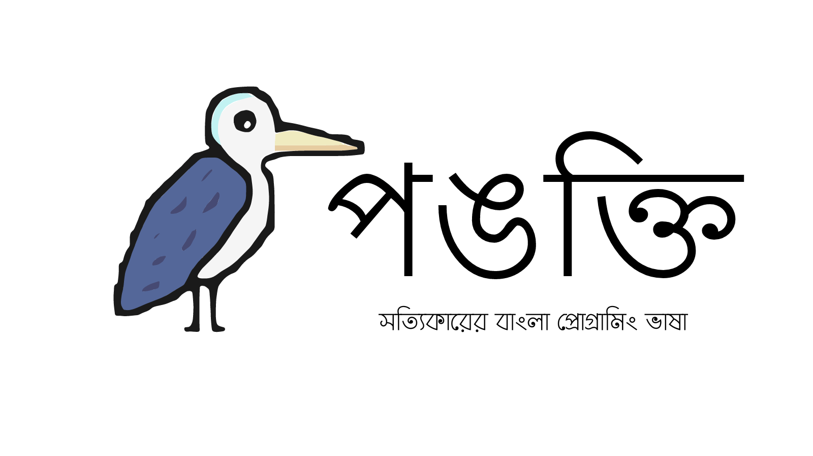

# The Pankti Programming Language

## Introduction
Pankti is a dynamically typed programming language for programming in Bengali.
Pankti lets you program in Bengali, English, and also Bengali words in English
letters. Pankti is easy to learn yet aims to be a powerful language similar to
other popular languages, such as Python or JavaScript. The syntax is designed in
such a way that it feels familiar to how Bengali is spoken in daily life, yet it
keeps resemblance to common programming syntax.

## পরিচিতি
পঙক্তি হল একটি প্রোগ্রামিং ভাষা যা দিয়ে বাংলা, ইংরেজি তে কম্পিউটার প্রোগ্রাম তৈরি করা যায়। পঙক্তি শেখা খুব সহজ হলেও এটি অন্যান্য প্রচলিত প্রোগ্রামিং ভাষার যেমন পাইথন, জাভাস্ক্রিপ্টের মতই শক্তিশালী।
এটি এমন ভাবে তৈরি করা হয়েছে যাতে সাধারণ জীবনে ব্যবহৃত বাচনভঙ্গির সাথে সাদৃশ্যতা বজায় থাকে সাথে সাথে অন্যান্য প্রোগ্রামিং ভাষাতে ব্যবহৃত রীতির সাথেও সাদৃশ্যতা বজায় রাখে। 

## Why
My native language, or mother tongue as they say, is Bengali. To date, there have been multiple attempts to build Bengali Programming Languages. Most of them never crossed the boundaries of being just a toy or an educational tool. 
But I wanted to do something different, I wanted to build something much more than an educational toy, I wanted to build a powerful yet easy to learn programming, thus Pankti was born. 
While we have computer-related courses in High Schools, they are limited to only the final two classes of High Schools in most cases. 
But National Education Policy 2020 aims to introduce coding way earlier, but a sudden shift from learn basic grammar of English to jumping to an English-only environment can be challenging, thus learning the basics of programming in their native language can make the shift smoother.


## Language Features
### Data Types:
* Strings/স্ট্রিং: `"Hello world"`, `"pankti"`, `পলাশ বাউরি `
* Numbers/সংখ্যা: `100`, `3.14`, `1234`, `১২৩৪৫৬৭৮৯০`, `৩.১৪`, `৯9.9৯`
* Dictionaries/HashMap/Map/ম্যাপ: `{"name" : "palash" , "time":7.22 , "পদবি" : "বাউরি" }`
* Array/তালিকা: `["রবিবার", "Monday", 1 , 2.34]`
* Booleans: `true`, `false`, `সত্যি`, `মিথ্যা`

## Variables:
```go
ধরি নাম = "পলাশ"
ধরি পুরোনাম = নাম + " বাউরি"
ধরি মাস = "বৈশাখ"
ধরি সাল = ২০২৩
```

## Functions:
```go
কাজ ঘুমানো(নায়ক)
    দেখাও(নায়ক + " এখন ঘুমোচ্ছে!")
শেষ
ঘুমানো("পলাশ")
```

```go
Output: পলাশ এখন ঘুমোচ্ছে
```

## Documentation
* <https://pankti.palashbauri.in>

## Project Status
> Pre-alpha. Under heavy development

## LICENSE
> MPL v2

>Note: Buno the Heron, the mascot is created by me, Palash Bauri, and is
licensed under [Creative Commons Attribution-NonCommercial-NoDerivatives 4.0 International](https://creativecommons.org/licenses/by-nc-nd/4.0/?ref=chooser-v1)

## Special Thanks:
Thorsten Ball for writing these amazing books, "Writing An Interpreter In Go" and "Writing A Compiler In Go", and Robert Nystrom for writing his awesome book, "Crafting Interpreters."
