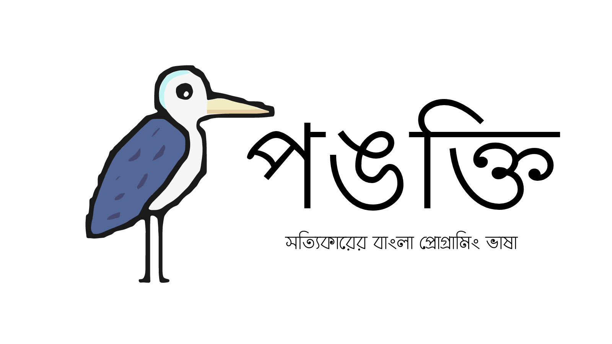

# The Pankti Programming Language


## Introduction
Pankti is a dynamically typed programming language for programming in Bengali,
English, Bengali phonetic as well as Combination of both. Pankti is an easy to 
learn programming language but it was also powerful language to create useful 
and fast programs.

## Why
My mother tongue is Bengali. Previously there have been few attempts to build 
a Bengali programming language but most of them have no practical usage, so I 
ventured into the dark world of language design.

## Language Features
### Data Types:
* Strings/স্ট্রিং: `"Hello world"`, `"pankti"`, `পলাশ বাউরি `
* Numbers/সংখ্যা: `100`, `3.14`, `1234`, `১২৩৪৫৬৭৮৯০`, `৩.১৪`, `৯9.9৯`
* Dictionaries/HashMap/Map/ম্যাপ: `{"name" : "palash" , "time":7.22 , "পদবি" : "বাউরি" }`
* Array/তালিকা: `["রবিবার", "Monday", 1 , 2.34]`
* Booleans: `true`, `false`, `সত্যি`, `মিথ্যা`

## Variables:
```go
ধরি নাম = "পলাশ"
ধরি পুরোনাম = নাম + " বাউরি"
ধরি মাস = "বৈশাখ"
ধরি সাল = ২০২৩
```

## Functions:
```go
    কাজ ঘুমানো(নায়ক)
        দেখাও(নায়ক + " এখন ঘুমোচ্ছে!")
    শেষ
    ঘুমানো("পলাশ")
```

```go
Output: পলাশ এখন ঘুমোচ্ছে
```


## Project Status
> Pre-alpha. Under heavy development

## LICENSE
> MPL v2

>Note: Buno the Hedgehog, and all artworks are copyrighted to Me, Palash Bauri, all
rights are reserved for the Buno the Hedgehog images.

## Special Thanks:
Thorsten Ball for writing these amazing book "Writing An Interpreter In Go" and "Writing A Compiler In Go" and Robert Nystrom for writing his awesome book "Crafting Interpreters"
